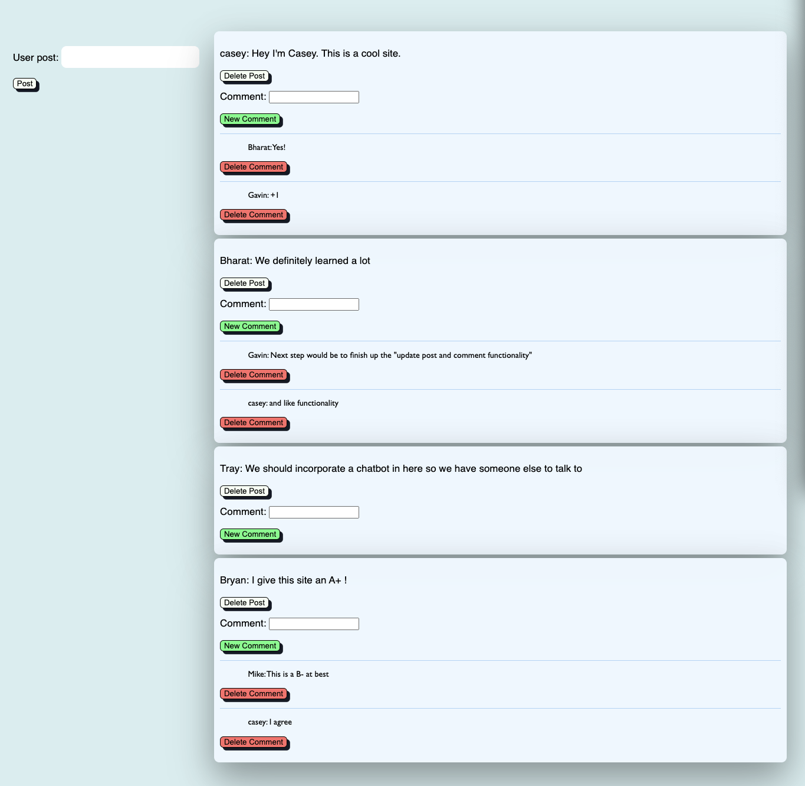

# MyBuddy
A social media network with an AI companion

## Description
MyBuddy is a social media page where users can create an account, login and post their thoughts to a public feed. Users can also create comments and delete old comments and posts. Future Development will add “like” functionality and explore integration with ChatGPT to respond to posts with its own comments.

## Screenshots

## Usage
1. Navigate to [MyBuddy](https://afternoon-beyond-13914.herokuapp.com/)
2. Create an account
3. On the homepage, create a post or comment on another post
4. Click the Delete button to remove one of your comments or posts

## Technologies
* JavaScript
* Handlebars
* CSS + Bootstrap
* Node.js + Express
* MySQL + Sequelize

## Credits
Teaching Staff at UCLA

## Contributing
Issue a pull request to contribute to this project

## License Info
n/a

